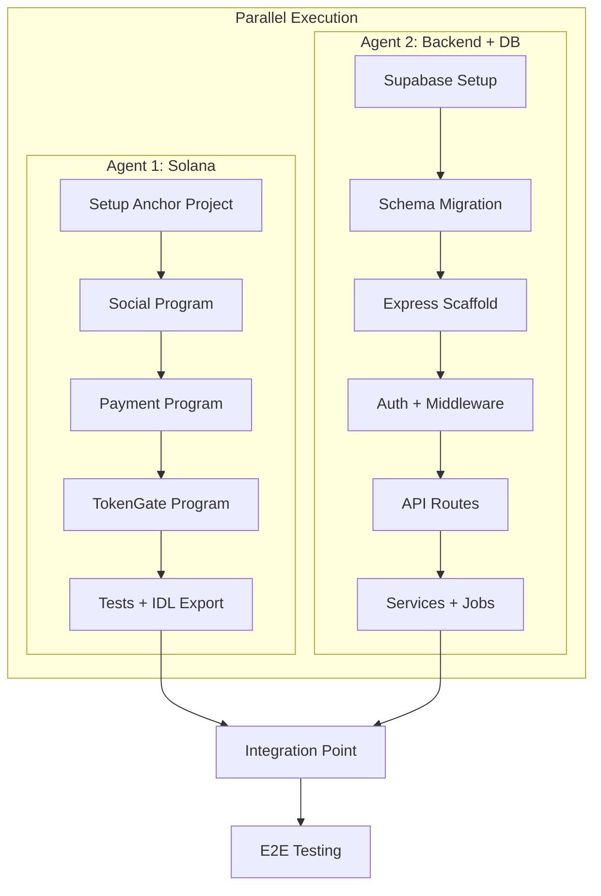

# SolShare V1 Execution Plan

## Architecture Overview



---

## Agent 1: Solana Programs (Phase 1)

**Duration:** 2-3 days | **Dependencies:** None | **Output:** IDL files for backend

### Step 1.1: Project Setup

1. Initialize Anchor workspace:
   ```bash
   anchor init solshare --javascript
   cd solshare
   ```

2. Configure `Anchor.toml` for devnet:

   - Set cluster to devnet
   - Configure wallet path

3. Create three programs in `programs/`:

   - `solshare-social`
   - `solshare-payment`
   - `solshare-token-gate`

**Reference:** [SOLSHARE_SPEC.md](SOLSHARE_SPEC.md) Section "Phase 1: Solana Programs" (lines 358-601)

### Step 1.2: Social Program (`solshare-social`)

Implement in order:

1. **State structs** (`state.rs`):

   - `UserProfile` - PDA seeds: `["profile", authority.key()]`
   - `Post` - PDA seeds: `["post", creator.key(), post_count.to_le_bytes()]`
   - `Follow` - PDA seeds: `["follow", follower.key(), following.key()]`
   - `Like` - PDA seeds: `["like", post.key(), user.key()]`
   - `Comment` - PDA seeds: `["comment", post.key(), comment_count.to_le_bytes()]`

2. **Instructions** (`lib.rs`):

   - `create_profile(username, bio, profile_image_uri)`
   - `update_profile(bio?, profile_image_uri?)`
   - `create_post(content_uri, content_type, caption, is_token_gated, required_token?)`
   - `like_post()` / `unlike_post()`
   - `follow_user()` / `unfollow_user()`
   - `comment_post(comment_text)`

3. **Events** (`events.rs`):

   - `ProfileCreated`, `PostCreated`, `PostLiked`, `UserFollowed`, `PostCommented`

4. **Errors** (`error.rs`):

   - Define custom error codes for validation failures

**Validation Rules:**

- username <= 32 chars
- bio <= 256 chars
- caption <= 2000 chars
- comment <= 500 chars
- Can't follow/like self

### Step 1.3: Payment Program (`solshare-payment`)

1. **State structs**:

   - `CreatorVault` - PDA: `["vault", creator.key()]`
   - `TipRecord` - PDA: `["tip", tipper.key(), timestamp.to_le_bytes()]`
   - `Subscription` - PDA: `["subscription", subscriber.key(), creator.key()]`

2. **Instructions**:

   - `initialize_vault()` - Create creator vault
   - `tip_creator(amount, post?)` - Transfer SOL + record
   - `subscribe(amount_per_month)` - Create subscription
   - `process_subscription()` - Crank for renewals
   - `cancel_subscription()` - Deactivate
   - `withdraw(amount)` - Creator withdraws

3. **Fee Logic**: 2% platform fee (configurable in program config account)

### Step 1.4: Token-Gate Program (`solshare-token-gate`)

1. **State structs**:

   - `AccessControl` - PDA: `["access", post.key()]`
   - `AccessVerification` - PDA: `["verification", user.key(), post.key()]`

2. **Instructions**:

   - `set_access_requirements(required_token?, minimum_balance?, required_nft_collection?)`
   - `verify_token_access()` - Check SPL token balance
   - `verify_nft_access()` - Check NFT ownership via Metaplex

### Step 1.5: Testing

Create test files in `tests/`:

| Test File | Coverage |

|-----------|----------|

| `social.ts` | All social instructions, edge cases |

| `payment.ts` | Tip, subscribe, withdraw flows |

| `token-gate.ts` | Access verification with mocked tokens |

**Target:** 90%+ coverage on all instructions

### Step 1.6: Build and Export

```bash
anchor build
anchor deploy --provider.cluster devnet
# Export IDLs for backend
cp target/idl/*.json ../backend/idl/
```

**Deliverables:**

- [ ] Three deployed programs on devnet
- [ ] Program IDs documented
- [ ] IDL files exported to `backend/idl/`
- [ ] Test suite passing

---

## Agent 2: Database + Backend (Phase 5 + Phase 2)

**Duration:** 3-4 days | **Dependencies:** Phase 5 before Phase 2 | **Output:** Running API

### Step 2.1: Supabase Project Setup

1. Create Supabase project at supabase.com
2. Note environment variables:

   - `SUPABASE_URL`
   - `SUPABASE_ANON_KEY`
   - `SUPABASE_SERVICE_ROLE_KEY`

3. Enable extensions via SQL Editor:
   ```sql
   CREATE EXTENSION IF NOT EXISTS "pgcrypto";
   CREATE EXTENSION IF NOT EXISTS "vector";
   ```


### Step 2.2: Database Schema Migration

Run the full schema from [SOLSHARE_SPEC.md](SOLSHARE_SPEC.md) lines 1338-1565:

**Core Tables:**

- `users` - Wallet-based user profiles
- `posts` - Posts with AI metadata columns
- `follows`, `likes`, `comments` - Social graph
- `interactions` - ML training data
- `transactions` - Payment history

**Moderation Tables:**

- `content_violations` - Violation log
- `blocked_content_hashes` - Instant block list
- `wallet_restrictions` - Repeat offenders
- `user_reports` - Community reports

**Functions:**

- `get_wallet_upload_limit(wallet)` - Returns upload limit based on violations

**Enable Realtime:**

```sql
ALTER PUBLICATION supabase_realtime ADD TABLE posts, likes, comments, follows;
```

### Step 2.3: Backend Project Scaffold

```bash
mkdir backend && cd backend
pnpm init
pnpm add express cors helmet zod jsonwebtoken @supabase/supabase-js
pnpm add ioredis bullmq @solana/web3.js @coral-xyz/anchor
pnpm add @aws-sdk/client-s3  # For R2
pnpm add pino pino-pretty  # Logging
pnpm add -D typescript @types/node @types/express tsx
```

Create file structure per [SOLSHARE_SPEC.md](SOLSHARE_SPEC.md) lines 617-670.

### Step 2.4: Configuration Layer

**`src/config/env.ts`** - Zod schema for all env vars:

```typescript
// Validate all required env vars at startup
// Reference: SOLSHARE_SPEC.md lines 1880-1942
```

**`src/config/supabase.ts`** - Supabase client setup

**`src/config/redis.ts`** - Upstash Redis + BullMQ connection

**`src/config/solana.ts`** - Solana connection + program initialization

**`src/config/r2.ts`** - Cloudflare R2 S3-compatible client

### Step 2.5: Auth Middleware

**`src/middleware/auth.ts`**:

1. Challenge-response flow:

   - Generate unique message with timestamp + nonce
   - Store challenge in Redis (5 min TTL)
   - Verify signature matches wallet
   - Issue JWT (7-day expiry)

2. JWT verification middleware:

   - Verify token
   - Attach wallet to request
   - Check wallet restrictions

**Reference:** [SOLSHARE_SPEC.md](SOLSHARE_SPEC.md) lines 699-712

### Step 2.6: Core Middleware

| File | Purpose |

|------|---------|

| `errorHandler.ts` | Global error handling, Sentry integration |

| `rateLimiter.ts` | Per-wallet rate limiting via Upstash |

| `validation.ts` | Zod schema validation wrapper |

**Rate Limits:** (from spec lines 824-832)

- GET: 1000/hour (auth), 100/hour (unauth)
- POST: 100/hour
- Upload: 50/hour
- Search: 200/hour (auth), 50/hour (unauth)

### Step 2.7: API Routes Implementation

Implement in this order:

**1. Auth Routes** (`/api/auth/*`):

- `POST /challenge` - Generate signing challenge
- `POST /verify` - Verify signature, return JWT
- `POST /refresh` - Refresh JWT

**2. User Routes** (`/api/users/*`):

- `GET /:wallet` - Get profile
- `POST /profile` - Create/update (returns unsigned tx)
- `GET /:wallet/posts` - Paginated posts
- `POST /:wallet/follow` / `DELETE /:wallet/follow`

**3. Post Routes** (`/api/posts/*`):

- `POST /upload` - **WITH GUARDRAIL CHECK** (critical)
- `POST /create` - Create post (returns unsigned tx)
- `GET /:postId` - Get post
- `POST /:postId/like` / `DELETE /:postId/like`
- `GET /:postId/comments` / `POST /:postId/comments`
- `POST /:postId/report` - Report post

**4. Feed Routes** (`/api/feed/*`):

- `GET /` - Personalized feed (requires auth)
- `GET /explore` - Trending
- `GET /following` - Chronological following

**5. Payment Routes** (`/api/payments/*`):

- `POST /tip` - Create tip tx
- `POST /subscribe` / `DELETE /subscribe/:creator`
- `GET /earnings` - Creator earnings
- `POST /withdraw` - Withdraw tx

**6. Search Routes** (`/api/search/*`):

- `POST /semantic` - Calls AI service (stub for now)
- `GET /suggest` - Autocomplete
- `GET /users` - Username search

### Step 2.8: Services Layer

| Service | Responsibility |

|---------|----------------|

| `solana.service.ts` | Build unsigned transactions using Anchor IDL |

| `ipfs.service.ts` | Pinata upload + R2 cache read/write |

| `ai.service.ts` | HTTP client to AI service (stub responses for now) |

| `cache.service.ts` | Redis caching patterns |

| `realtime.service.ts` | Supabase Realtime broadcasts |

### Step 2.9: BullMQ Job Workers

**`src/jobs/queues.ts`** - Define queues:

- `ai-analysis` - Stub (calls AI service when ready)
- `embedding` - Stub
- `notification` - Send via Supabase Realtime
- `feed-refresh` - Recompute feeds
- `sync-chain` - Sync on-chain data to DB

**`src/worker.ts`** - Worker entry point (separate process)

### Step 2.10: Upload Guardrail Flow

Critical implementation in `POST /api/posts/upload`:

```
1. Receive image file (multipart)
2. Check wallet restriction level (DB function)
3. Generate perceptual hash
4. Check against blocked_content_hashes table
5. [STUB] Call AI moderation (return "allow" for now)
6. Upload to IPFS (Pinata)
7. Cache in R2
8. Return { contentUri, moderationResult }
```

The AI moderation call will be stubbed to return "allow" until Agent 3/AI research is complete.

### Step 2.11: Testing

| Test Type | Coverage |

|-----------|----------|

| Unit tests | Controllers, services (80%+) |

| Integration | Auth flow, post creation, payments |

| API tests | All endpoints with Supertest |

### Step 2.12: Procfile + Deploy Config

**`Procfile`:**

```
web: npm run start:api
worker: npm run start:worker
```

**Deliverables:**

- [ ] Supabase schema deployed
- [ ] All API endpoints working
- [ ] BullMQ workers running
- [ ] Rate limiting active
- [ ] Guardrail flow implemented (AI stubbed)
- [ ] Test suite passing

---

## Agent 3: AI/ML Boilerplate (Optional - Phase 3)

**Status:** On hold pending research | **Can scaffold:** Yes

If you want a boilerplate that works regardless of model choice:

### Scaffold Only (No Model Specifics)

```
ai-service/
├── app/
│   ├── main.py                 # FastAPI entry
│   ├── config.py               # Pydantic settings (env vars)
│   ├── api/routes/
│   │   ├── analyze.py          # /api/analyze/content
│   │   ├── search.py           # /api/search/semantic
│   │   ├── recommend.py        # /api/recommend/feed
│   │   └── moderate.py         # /api/moderate/check
│   ├── services/
│   │   ├── llm.py              # Abstract LLM interface
│   │   ├── embeddings.py       # Abstract embedding interface
│   │   ├── vector_db.py        # Qdrant client
│   │   └── moderator.py        # Moderation logic
│   └── models/schemas.py       # Pydantic request/response models
├── requirements.txt
├── Dockerfile
└── .env.example
```

**What can be built now:**

- FastAPI structure
- Request/response Pydantic schemas (from spec)
- Qdrant client setup
- Abstract interfaces for LLM and embeddings (swap implementations later)
- Moderation scoring logic (thresholds are defined)

**What requires research:**

- LLM provider choice (Claude vs GPT-4o vs Gemini)
- Embedding model choice (OpenAI vs Cohere vs Voyage)
- Cost optimization strategies

**Recommendation:** Build the boilerplate with abstract interfaces. When research is complete, you only need to implement the concrete providers.

---

## Integration Checklist

After both agents complete:

1. [ ] Copy IDL files from Solana build to `backend/idl/`
2. [ ] Update backend env with deployed program IDs
3. [ ] Test end-to-end post creation flow
4. [ ] Test tip payment flow
5. [ ] Verify Realtime updates work
6. [ ] Run full test suite

---

## Security Reminders

Per [SOLSHARE_SPEC.md](SOLSHARE_SPEC.md) Security Requirements (lines 1725-1835):

**Solana Programs:**

- Reentrancy protection on payments
- Authority checks on all mutations
- Rate limiting via account creation costs

**Backend:**

- JWT auth with 7-day expiry
- Wallet signature verification
- Rate limiting per wallet
- Input validation (Zod)
- SQL injection prevention (Supabase handles)
- CORS restricted to frontend domain

**Content:**

- Pre-upload guardrail (AI check before IPFS)
- Perceptual hash blocking
- Repeat offender tracking
- Violation logging

---

## Reference Document

All agents MUST reference [SOLSHARE_SPEC.md](SOLSHARE_SPEC.md) for:

- Exact field types and sizes
- PDA seed patterns
- API response formats
- Error codes
- Caching strategies
- Rate limit values